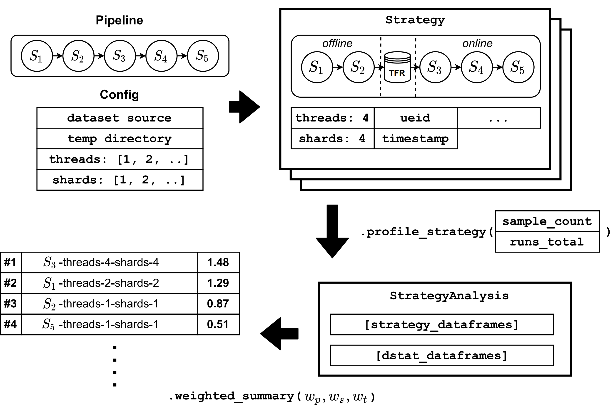

# PRESTO

**Pre**processing **St**rategy **O**ptimizer is a library for TensorFlow that automates the generic pipelines’ profiling process.

---
### Structure

* [analysis](analysis) - IPython notebooks to create plots/analyse the logs
* [bin](bin) - scripts to run experiments, setup the environment
* [cream](cream) - a preprocessing library for the CREAM dataset
* [logs](logs) - the logging directory, with sample artefacts from the paper for each pipeline
  - Because the logs for the paper take up close to 10GB, please contact the authors for the full logs. The notebooks have prerendered plots already.
* [presto](presto) - the presto library, use one of the `*_demo.py` pipelines in the root directory for example usage
* [tests](tests)

---
### First steps for reproducing the results of the paper

Download the following datasets:

* ILSVRC2012 [Link](https://www.kaggle.com/c/imagenet-object-localization-challenge)
* Cube++ [Link](https://zenodo.org/record/4153431)
* OpenWebText [Link](https://huggingface.co/datasets/openwebtext)
* CREAM [Link](https://mediatum.ub.tum.de/1554766)
* Commonvoice [Link](https://commonvoice.mozilla.org/en/datasets), only `en` subset
* Librispeech [Link](http://www.openslr.org/12), currently down, message me for my copy

Configure the dataset locations in the `*_demo.py` files, depending on which you want to run.
Locations you need to configure:
* `source_path` - dataset location
* `target_path` - where do you want to save the intermediate strategy reprensentations (default is `.`, and we will create a lot of directories. `make clean` removes these)
The first argument is the thread/shard count, second is the sample size.

---
### Presto Prototype Visualization



**Example:**
```bash
> source activate presto
(presto) > python imagenet_demo.py 8 8000 none local-ssd
```

If you run the NLP experiment, it can, and probably will segfault. Use the [`repeat_experiment.sh`](bin/repeat_experiment.sh) to run the demos for `n` times with each configuration. Don't forget to adjust the `run_count` variable in the `*_demo.py`.

To concat the resulting logs, use the [`concat-csv-log-files.sh`](bin/concat-csv-log-files.sh) as follows (works for both `cum-df` and `cum-dstat-df` logs):
```bash
presto/logs> ls 
log-run-1-cum-df.csv
log-run-2-cum-df.csv
log-run-3-cum-df.csv
presto/logs> ../bin/concat-csv-log-files.sh log-run-1-cum-df.csv log-run-2-cum-df.csv log-run-3-cum-df.csv > log-run-1-2-3-cum-df.csv
presto/logs> ls 
log-run-1-cum-df.csv
log-run-2-cum-df.csv
log-run-3-cum-df.csv
log-run-1-2-3-cum-df.csv
```

Dstat logs are saved in raw form at the created subdirectories depending on the configuration, but
will be aggregated on every successfully ran script and saved to `/logs`.

You will get **2** `.csv` files, one will have an automatically generated name based on the configuration
with:
* `cum_df` - python logged profile
* `cum_dstat_df` - dstat logged profile, but in a form that is comparable to the `cum_df` to match the strategies

For the CREAM pipeline, you will need to modify the [cream_pipeline.py](cream_pipeline.py) as well, as it needs special additional paths to the dataset.

After that you will need to start IPython and run any of the notebooks in [analysis](analysis),
depending on the pipeline your ran. Update the two files in the first cells and you should
automatically generate all the plots used in the paper.

### Recreate plots without experiments

Just run all the notebooks in [analysis](analysis), the logs are already there. Call IPython from the root directory:

```bash
<your-dir>/presto> source active presto
(presto) <your-dir>/presto> jupyter notebook
```

---
### Setup the environment

Skip **Local** steps if everything is executed locally. Commands are for `apt`, so change them according to your Linux flavor.

* **Remote**: Clone this repo: `https://github.com/cirquit/presto`
* **Remote**: Install miniconda: `./bin/install-miniconda.sh`
* **Remote**: Source .bashrc: `source ~/.bashrc`
* **Remote**: Create environment: `./bin/create-py3.7-env.sh`
* **Remote**: Activate environment: `conda activate presto`
* **Remote**: Update system: `sudo apt update`
* **Remote**: Install packages for experiments: `sudo apt-get install dstat unzip build-essential libsndfile-dev ffmpeg`
* **Remote**: Install deps: `pip install -r requirements.txt`
* **Remote**: Run notebook: `jupyter notebook --no-browser --port=8889`
* **Local**: Mirror port: `ssh -N -L localhost:8888:localhost:8889 -i .ssh/your-custom-key user@<ip>`
* **Local**: Open up the link which `jupyter` provided, change the port to `8888`
* **Remote**: Enable sudo use from python - [Link](https://askubuntu.com/questions/155791/how-do-i-sudo-a-command-in-a-script-without-being-asked-for-a-password), needed for dstat

---
### How to use Presto for your own experiments

There are basically two things needed:
* A definition of your pipeline (take [`imagenet_pipeline.py`](imagenet_pipeline.py) as an example)
* Generate the different strategies based on the pipeline, see [`imagenet_demo.py`](imagenet_demo.py)
* Run the experiments with `.profile_strategy(...)` with all the possible configuration options (see [`presto/strategy.py`](presto/strategy.py) as reference)
* Load the logs, saved as `pd.Dataframes` into a [`StrategyAnalysis`](presto/analysis.py) and analyze the data with, e.g., a `weighted_summary(...)` call
* The scores are presorted, you can decide on which strategy you want to decide, or automatically pick the highest one. The corresponding strategy is a valid `tf.data.Dataset` pipeline, so you can just reuse it in your pipeline.

---
### Errors

There are some TensorFlow issues, like segfaults when dealing with a high memory usage. Just repeat
the experiment and hope that it works. 20GB RAM is enough for most experiments, except the full
dataset pipelines of NLP and NILM.

Example TF error:

`Exception ignored in: <function _RandomSeedGeneratorDeleter.__del__ at 0x7fac655f40e0>`

and its results:

```
Traceback (most recent call last):
  File "/home/asa/.miniconda/envs/pbr-prototype/lib/python3.7/site-packages/tensorflow_core/python/data/ops/dataset_ops.py", line 3462, in __del__
AttributeError: 'NoneType' object has no attribute 'device'
```

---
### Tests

By far not enough yet, but it's a start. Credits to Jeff.

```python
> python -m unittest tests.pipeline_test
```
